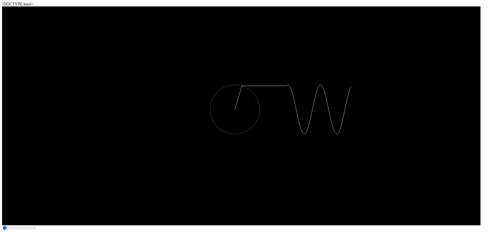

# Fourier-series

<ul>
<li>This project Visually demonstrates Fourier Series
  <li>In mathematics, a Fourier series (/ˈfʊrieɪ, -iər/[1]) 
is a periodic function composed of harmonically related sinusoids, 
combined by a weighted summation. With appropriate weights, 
one cycle (or period) of the summation can be made to approximate 
an arbitrary function in that interval (or the entire function if it too is periodic). 
As such, the summation is a synthesis of another function. 
The discrete-time Fourier transform is an example of Fourier series. 
The process of deriving weights that describe a given function is a form 
of Fourier analysis. For functions on unbounded intervals, the analysis 
and synthesis analogies are Fourier transform and inverse transform.
</ul>

